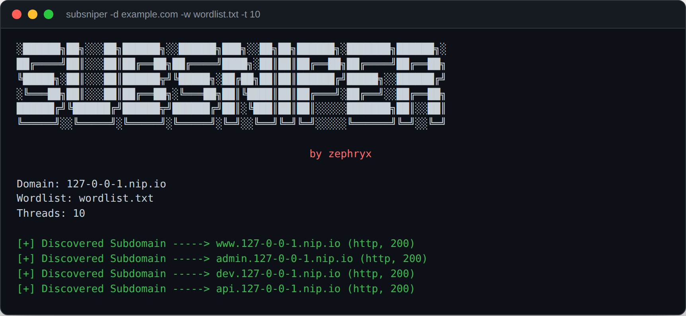
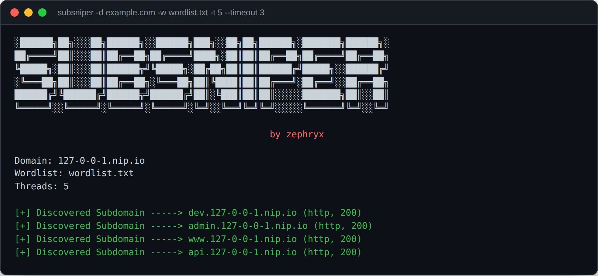

# SubSniper
```SubSniper``` is a powerful subdomain enumeration tool designed to quickly discover subdomains of a target domain. With its simple yet efficient approach, ```SubSniper``` helps security professionals, penetration testers, and bug bounty hunters in their reconnaissance phase to identify potential entry points and vulnerabilities in web applications.


## Features
- **Fast and Efficient:** SubSniper dispatches requests across a configurable thread pool (`-t`/`--threads`, default 20), with a per-request timeout (`--timeout`) so one slow or hanging host can't stall the whole scan.
- **HTTPS with HTTP Fallback:** Each candidate is tried over HTTPS first; if the connection itself fails, SubSniper retries over plain HTTP before giving up.
- **Customizable Wordlists:** Users can specify their own wordlists or rely on a default wordlist for subdomain discovery.
- **User-Friendly:** With a straightforward command-line interface, SubSniper is easy to use for both beginners and experienced users.
- **Flexible:** SubSniper allows users to customize various parameters to suit their specific needs, including the target domain and wordlist.

## Screenshots

### Concurrent scan with HTTPS→HTTP fallback
Requests run in parallel across the thread pool; each candidate is tried over HTTPS first and falls back to HTTP when the connection itself fails, as shown by the `(http, 200)` annotation on every hit below.


### Custom threads and timeout
`-t 5 --timeout 3` tunes the thread pool size and per-request timeout for the target at hand.


## Usage
To start using ```SubSniper```, simply specify the target domain using the -d or --domain option and provide a wordlist using the -w or --wordlist option. If no wordlist is provided, ```SubSniper``` will default to using default.txt.
```
python3 subsniper.py -h
```

#### Example usage:
```
python3 subsniper.py -d example.com -w path/to/wordlist
```
### Note: Press Enter to use default wordlist.!

## Installation:

> Clone the SubSniper repository from GitHub:
```
git clone https://github.com/zephryx01/SubSniper.git
```

> Navigate to the SubSniper directory:
```
cd SubSniper
```

> Ensure you have Python 3 installed on your system.

> Install the required dependencies:
```
pip install -r requirements.txt
```

> Run SubSniper using Python:
```
python3 subsniper.py -d example.com -w path/to/wordlist
```
